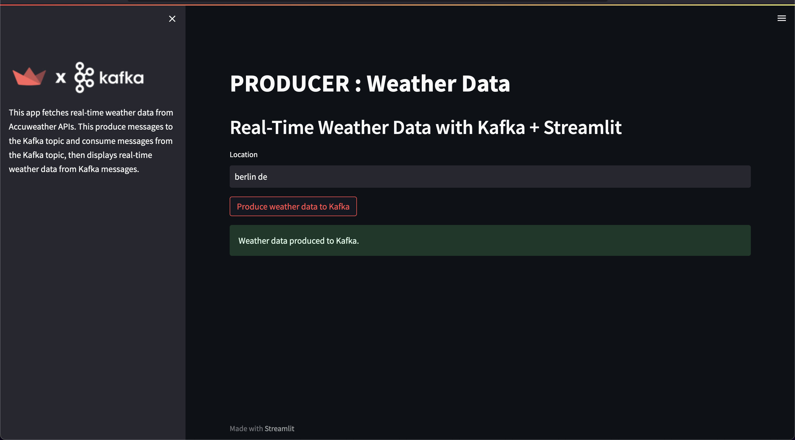
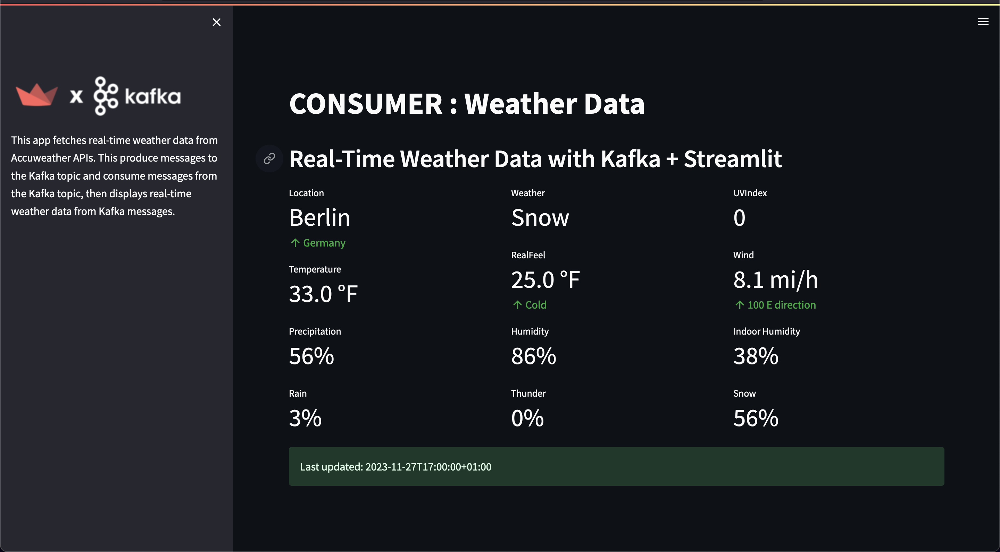

# Real-time Weather Reporting App
Real-time weather data from Accuweather APIs using Kafka + Streamlit dashboards.

**A simple Python app to display the workflows of Kafka with easy-to-use Streamlit UI.**

**Kafka** is a distributed publish-subscribe messaging system that maintains feeds of messages in partitioned and replicated topics. In the simplest way there are three players in the Kafka ecosystem: producers, topics (run by brokers) and consumers.

**Producers** produce messages to a topic. It is possible to attach a key to each message, in which case the producer guarantees that all messages with the same key will arrive to the same partition. **Topics** are logs that receive data from the producers and store them across their partitions. Producers always write new messages at the end of the log. In our example we made abstraction of the partitions, since we’re working locally.

**Consumers** read the messages of a set of partitions of a topic of their choice at their own pace. If the consumer is part of a consumer group, i.e. a group of consumers subscribed to the same topic, they can commit their offset. This can be important if a topic is needed to consume in parallel with different consumers.

## Producer Dashboard
The producer dashboard takes a location name as input, searches **Accuweather API** and receives current Weather data from it's APIs. Then, the **Kafka Producer** publises the Weather data to a Kafka topic.


## Consumer Dashboard
The consumer receives the published Weather data from the same Kafka topic and displayes in the consumer dashboard.


## How to use
1. Download the latest Kafka release and extract it: https://www.apache.org/dyn/closer.cgi?path=/kafka/3.6.0/kafka_2.13-3.6.0.tgz
2. Install dependencies with:
```python
pip -r requirements.txt
```
3. Goto Kafka directory, to work in local machine, make changes in `config/server.properties` file.
Set `advertised.listeners` to `PLAINTEXT://localhost:9092`.
4. Run the following commands in order to start all services in the correct order. Run **Zookeeper** first:
```python
bin/zookeeper-server-start.sh config/zookeeper.properties
```
5. Open another terminal session and run to start **Kafka broker server**:
```python
bin/kafka-server-start.sh config/server.properties
```
6. Run producer dashboard:
```python
streamlit run producer_app.py
```
7. Run consumer dashboard:
```python
streamlit run consumer_app.py --server.port 8503
```

Enjoy!


